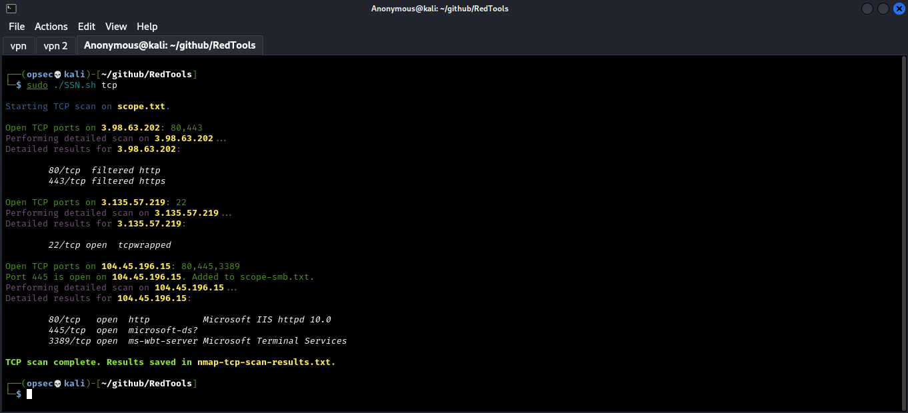
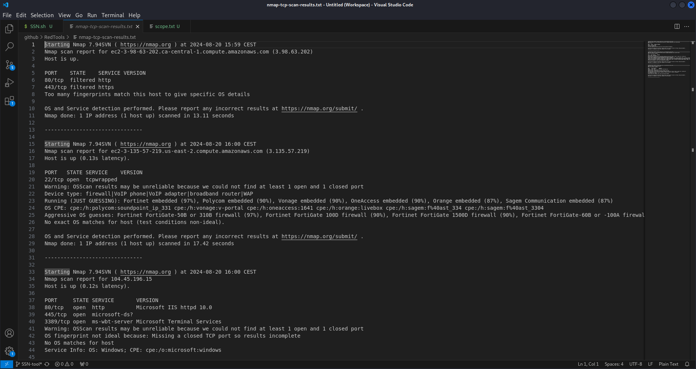

# RedTools

Set of tools developed by me to help with my day-to-day activites as Penetration Tester.

## Scan Scope with Nmap (SSN)

Simple bash script that I've created to partially automate the process of Infrastracture Penetration Tests. I am planning to develop it further and include many other checks.

The `scope.txt` file should be defined by user. On the other hand, `scope-smb.txt` is empty because it's going to fill itself up while discovering new open SMB ports using TCP scan.

```bash
# Usage: sudo ./SSN.sh {all|tcp|udp|smb}
#  all  - Run a TCP, UDP, and SMB scan and perform detailed service version checks
#  tcp  - Run a TCP scan and perform detailed service version checks
#  udp  - Run a UDP scan and save only the information about open UDP ports
#  smb  - Run SMB enumeration using enum4linux and crackmapexec on targets in scope-smb.txt

# Example
cat scope.txt

3.98.63.202
3.135.57.219
104.45.196.15

sudo ./SSH.sh all
```





## Disclaimer

RedTools repository is intended solely for the purpose of testing and validating scopes of legitimate penetration tests. These tools are designed to assist administrators and auditors in ensuring that networks and devices adhere to predefined standards and guidelines.

The creators and maintainers of this tool are not responsible for any misuse or legal implications arising from its use. Always ensure that you have the proper authorization before performing any configuration analysis.

The IPs that were used to test out the script were gathered with the help of shodan.io, and the information that is presented on the screenshots is available publicly.
